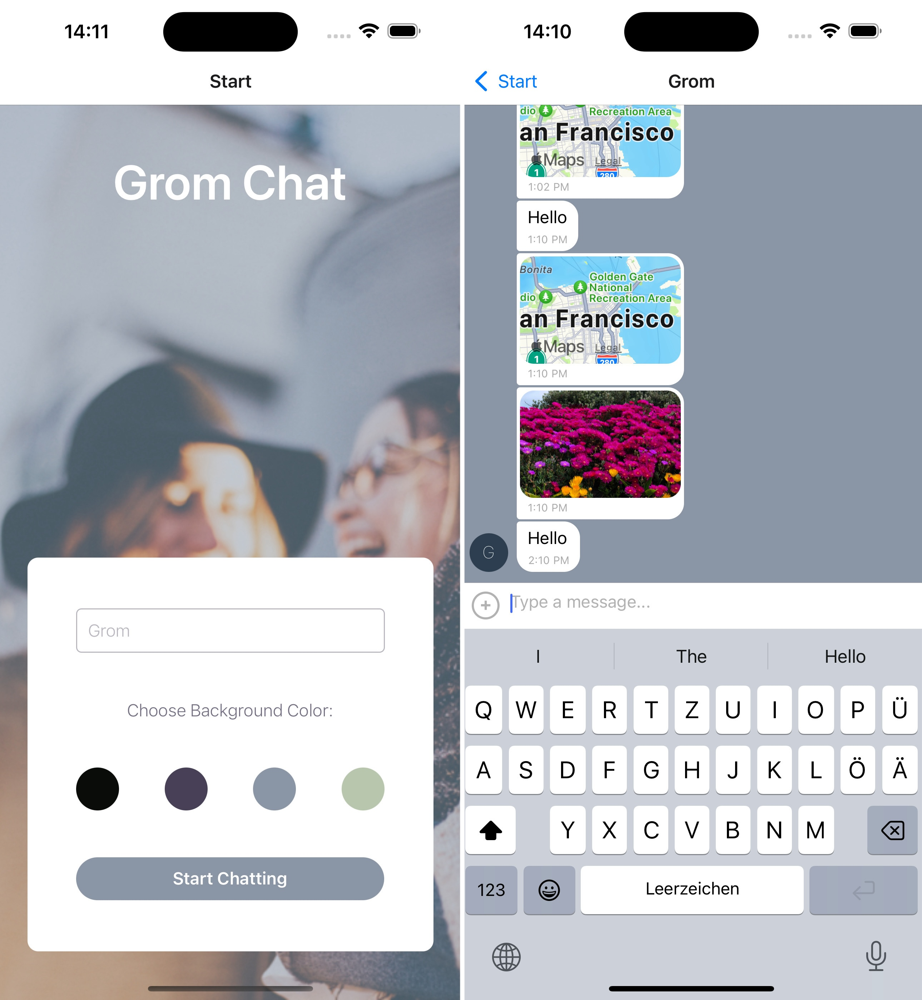

# Grom Chat: Mobile Chat App
## Project description

- **Instant Communication:** Effortlessly chat, share images, and update your location with just a few taps.
- **Seamless Connectivity:** Stay connected with friends and family, whether online or offline, ensuring you never miss a moment.
- **Accessibility:** Our inclusive design supports screen readers, making it accessible for visually impaired users.

---

## Tech Stack Overview

- **React Native:** Core framework for building the app.
- **Expo:** Utilized for streamlined development processes.
- **Stylish Design:** Matches specific screen design aesthetics.
- **Google Firestore Database:** Stores chat conversations securely.
- **Google Firebase Authentication:** Provides anonymous user authentication.
- **Local Storage:** Enables offline access to chat conversations.
- **Image Sharing:** Supports uploading images from the library or capturing new ones.
- **Firebase Cloud Storage:** Securely stores shared images.
- **Location Data:** Integrates location sharing within chat through a map view.
- **Gifted Chat Library:** Powers the chat interface and functionalities.
- **Well-Documented:** Codebase is thoroughly commented for clarity.

---

## Setup Instructions

Follow these steps to get the app running on your local machine:

1. **Clone the repository:** Use the command `git clone https://github.com/yougrom/gromchat.git` to clone the repository to your local machine.

2. **Navigate to the project directory:** Use the command `cd your-repo-name` to navigate into the root directory of the project. Remember to replace `your-repo-name` with the actual name of your repository.

3. **Install Node.js and npm:** If you don't have Node.js and npm installed, download them from [here](https://nodejs.org/).

4. **Install Expo CLI:** Use the command `npm install -g expo-cli` to install Expo CLI globally on your machine.

5. **Install dependencies:** Use the command `npm install` to install all the necessary dependencies for the project.

6. **Start the app:** Use the command `npm start` to start the app. This will open a new browser window with the Expo developer tools.

7. **Run the app on your device/emulator:** You can either use an Android/iOS emulator or directly run the app on your mobile device using the Expo Go app. Scan the QR code displayed in the Expo developer tools with the Expo Go app to run the app on your device.

   Please note that you'll need to have the Expo Go app installed on your device to run the app. You can download it from the [App Store](https://apps.apple.com/app/expo-go/id982107779) or [Google Play Store](https://play.google.com/store/apps/details?id=host.exp.exponent&referrer=www).

